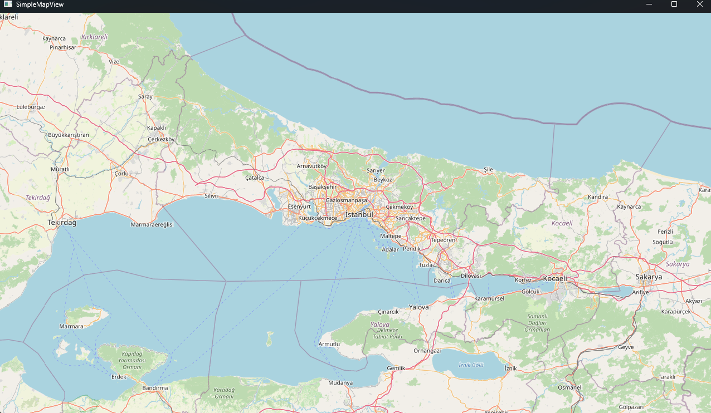
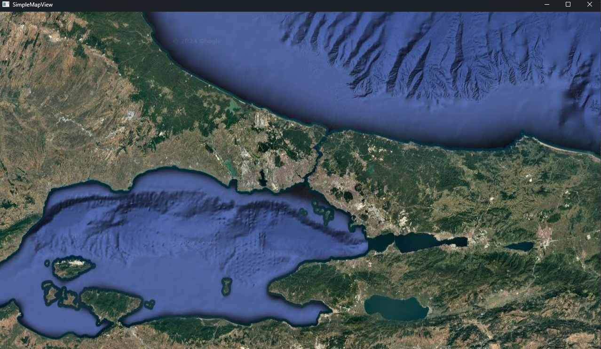

# SimpleMapView

A Qt widget for rendering tile maps.

- [Setup](#setup)
- [Map Widget](#map-widget)
    - [Create Widget](#create-widget)
    - [Change Tile Server](#change-tile-server)
    - [Limit Zoom](#limit-zoom)
    - [Lock Zoom and Geolocation](#lock-zoom-and-geolocation)
    - [Disable Mouse Events](#disable-mouse-events)
- [Markers](#markers)
    - [Add Marker](#add-marker)
    - [Remove Marker](#remove-marker)
    - [Change Default Marker Icon](#change-default-marker-icon)

## Setup

after including the ``.h`` and ``.cpp`` files, add the ``Positioning`` and ``Network`` modules to the build system.
Then add the marker icons to one of your ``.qrc`` files.

cmake:
```cmake
find_package(Qt6 REQUIRED COMPONENTS Network Positioning)
target_link_libraries(mytarget PRIVATE Qt6::Network Qt6::Positioning)
```

qmake
```
QT += network
QT += positioning
```

Resources.qrc
```xml
<RCC>
  <qresource>
    <file alias="map_marker.svg">path/to/map_marker.svg</file>
    <file alias="map_marker_alt.svg">path/to/map_marker_alt.svg</file>
  </qresource>
</RCC>
```

## Map Widget

### Create Widget

create the widget inside the main window's constructor, then set the zoom level and the center coordinates to the place you want to display.

```c++
SimpleMapView* mapView = new SimpleMapView(this);
mapView->move(0, 0);
mapView->resize(this->width(), this->height()); // full screen

mapView->setCenter(41.010172, 28.957912); // İstanbul, Türkiye
mapView->setZoomLevel(9);
```



### Change Tile Server

you can use any tile server that contains ``{x}``, ``{y}``, and ``{z}`` coordinates in the URL.

```c++
mapView->setTileServer(SimpleMapView::TileServers::GOOGLE_MAP);
mapView->setTileServer(SimpleMapView::TileServers::GOOGLE_SAT);
mapView->setTileServer("https://a.tile.maptiler.com/{z}/{x}/{y}.png?key=YOUR_API_KEY");
``` 


### Limit Zoom

you can set limit (min/max) to zoom level.
```c++
mapView->setMinZoomLevel(10);
mapView->setMaxZoomLevel(17);
```

### Lock Zoom and Geolocation

```c++
mapView->lockZoom();
mapView->unlockZoom();

mapView->lockGeolocation();
mapView->unlockGeolocation();
```

### Disable Mouse Events

by default, you can move the map by holding the left mouse button down and moving the mouse. And you can zoom in/out via the mouse wheel.

```c++
mapView->disableMouseWheelZoom();
mapView->enableMouseWheelZoom();

mapView->disableMouseMoveMap();
mapView->enableMouseMoveMap();
```

## Markers

> [!IMPORTANT]
> markers are children of the map widget and will be destroyed automatically when the parent is destroyed.

### Add Marker

```c++
MapMarker* marker = mapView.addMarker(this->mapView.center());
marker->changeIcon(":/map_marker_alt.svg");
marker->setIconSize(64, 64); // change the size the icon is rendered on map
marker->replaceIconColor(Qt::blue); // change color of all non-transparent pixels
marker->replaceIconColor(Qt::red, Qt::blue); // change color of all red pixels
marker->setLabel("Center");
marker->setLabelFont(QFont("Sans Serif", 14));
marker->setLabelColor(Qt::blue);
marker->setPosition(48.858148, 2.350809)
```

### Remove Marker

> [!CAUTION]
> removing the marker will destroy it.

```c++
mapView.removeMarker(marker);
mapView.clearMarkers();
```

### Change Default Marker Icon

```c++
MapMarker::defaultMarkerIconPath = ":/map_marker_alt.svg";
```
